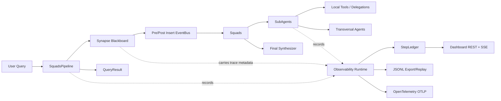
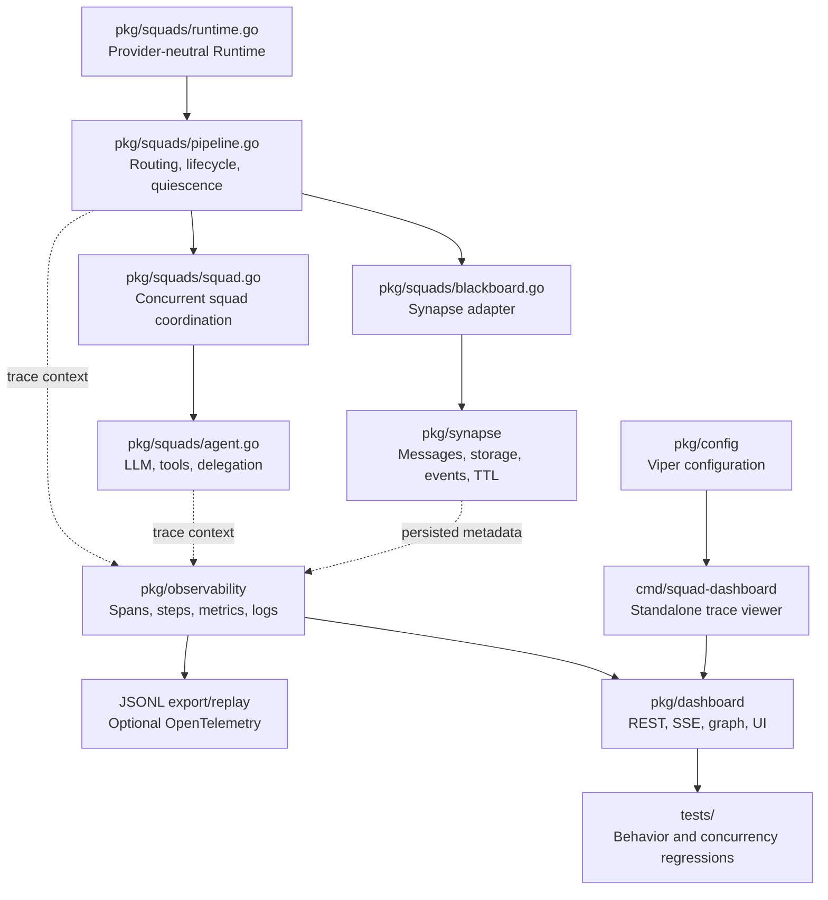

# Agent Squad Go


## What This Project Provides

- A blackboard messaging engine (`pkg/synapse`) for context, task, and command messages.
- A multi-agent orchestration layer (`pkg/squads`) with squads, subagents, transversal agents, observers, and final synthesis.
- An observability layer (`pkg/observability`) that records spans, business-level steps, JSONL traces, correlated logs, and optional OpenTelemetry export.
- A dashboard (`pkg/dashboard`) with REST endpoints, SSE live streaming, embedded web UI, graph projection, timeline, and metrics summaries.

## Architecture At A Glance



## Project Structure

```
agent-squad-go/
├── cmd/
│   └── squad-dashboard/      # Standalone dashboard for live or persisted traces
├── pkg/
│   ├── dashboard/            # REST API, SSE stream, embedded UI, graph/metrics projections
│   ├── observability/        # Trace context, spans, step ledger, hub, exporters, OTel runtime
│   ├── synapse/              # Core blackboard engine and persisted message model
│   └── squads/               # Multi-agent orchestration framework
├── tests/
│   ├── dashboard/            # Dashboard graph/API/SSE/replay tests
│   ├── observability/        # Tracing, logging, and OTel tests
│   ├── squads/               # Agent, squad, metrics, tool, and propagation tests
│   └── synapse/              # EventBus, SendMessage, ConsumeTask, GC tests
├── go.mod
└── README.md
```

## Code Functionality Map

The following map connects the user-facing capabilities with the Go packages that implement them.



| Capability | Main implementation | What it provides | Validation |
| --- | --- | --- | --- |
| Application configuration | `pkg/config/config.go` | Viper-backed flags, environment variables, defaults, and fail-fast validation. | `tests` and `pkg/config/config_test.go` |
| Declarative runtime | `pkg/squads/runtime.go` | Registers squads and agents, resolves provider callbacks, owns lifecycle, and exposes observability. | `tests/squads` |
| Query orchestration | `pkg/squads/pipeline.go` | Routes queries, starts concurrent work, enforces timeout and iteration limits, waits for quiescence, and assembles `QueryResult`. | `tests/squads` |
| Squad and agent execution | `pkg/squads/squad.go`, `pkg/squads/agent.go` | Runs agents, LLM calls, local tools, healing retries, transversal tasks, and cross-squad delegation. | `tests/squads` |
| Blackboard messaging | `pkg/synapse/engine.go`, `models.go` | Stores context, task, and command messages with atomic task consumption, TTL cleanup, and trace metadata. | `tests/synapse` |
| Event-driven integration | `pkg/synapse/events.go`, `pkg/squads/observer.go` | Dispatches typed pre-insert and post-insert hooks to squads, observers, and transversal agents. | `tests/synapse`, `tests/squads` |
| Persistence boundary | `pkg/synapse/storage.go` | Keeps the engine independent from storage implementations and provides thread-safe in-memory storage. | `tests/synapse` |
| Execution metrics | `pkg/squads/metrics.go` | Tracks lifecycle, LLM usage, delegation, retries, task outcomes, and categorized errors. | `tests/squads` |
| Trace reconstruction | `pkg/observability/context.go`, `pkg/squads/telemetry.go` | Propagates correlation, trace, span, causation, step, and parent-thread metadata across asynchronous work. | `tests/squads`, `tests/synapse` |
| Business-level observability | `pkg/observability/step.go`, `hub.go`, `logger.go` | Records bounded timelines, correlated logs, live events, subscriber health, and dropped SSE events. | `tests/observability`, `tests/dashboard` |
| Trace export and replay | `pkg/observability/exporter.go` | Writes JSONL traces and incrementally replays complete records without duplicating steps. | `tests/observability`, `tests/dashboard` |
| External telemetry | `pkg/observability/tracer.go`, `otel_runtime.go` | Supplies noop, recorder, and optional OpenTelemetry tracing implementations. | `tests/observability` |
| Dashboard projections | `pkg/dashboard/api.go`, `graph.go`, `sse.go` | Serves query timelines, workflow graphs, metrics, embedded assets, and live `AgentStep` events. | `tests/dashboard` |
| Dashboard frontend | `pkg/dashboard/web/` | Renders Mermaid Sequence, State, Mindmap, and Flowchart views with chronological events, query drawer, timeline, metrics, logs, tooltips, PNG export, and participant inspector from read-only projections. | `node --check pkg/dashboard/web/app.js`, `tests/e2e` |
| Manual compatibility experiment | `local-tests/use-case/` | Runs four declarative squads for manual discovery, concurrent evidence ingestion, compatibility synthesis, and reporting without adding domain behavior to core packages. | Nested module tests and mock run |

## Package Responsibilities

### `pkg/synapse`

Synapse is the blackboard engine. It stores messages, emits lifecycle hooks, supports task consumption, and keeps trace metadata attached to persisted messages so asynchronous callbacks can reconstruct causality.

- `models.go`: defines `SynapseMessage`, roles, message classes, trace metadata, and constructors for context/task/command messages.
- `engine.go`: owns in-memory indexes, context cache, atomic task consumption, storage writes, post-insert dispatch, and TTL garbage collection.
- `events.go`: implements the pre-insert/post-insert event bus used by observers, squads, and transversals.
- `storage.go`: defines the persistence boundary (`BaseStorage`) plus the default in-memory-only `NoopStorage`.
- `agent-squad.code-workspace`: local VS Code workspace helper.

### `pkg/squads`

Squads is the orchestration layer. It routes a query to one or more squads, runs subagents concurrently, delegates tasks, waits for the execution tree to become quiescent, and returns a traceable `QueryResult`.

- `pipeline.go`: top-level coordinator, routing, lifecycle, quiescence detection, timeout, max-iteration guard, result assembly.
- `squad.go`: squad event subscriptions, subagent fan-out, squad-level coordination, parent-thread replies.
- `agent.go`: base agents, subagents, transversal agents, LLM loop, tool calls, delegation, tool-healing retries.
- `blackboard.go`: blackboard abstraction, Synapse adapter, parent-thread map, bounded metrics store, observability runtime holder.
- `metrics.go`: thread-safe execution metrics for squads, agents, observers, transversals, LLM usage, and delegations.
- `observer.go`: pre-insert middleware, including reference expansion.
- `synthesizer.go`: context compaction through synthesis checkpoints.
- `telemetry.go`: shared observability helpers for spans, steps, correlated logging, and trace reconstruction from persisted messages.

### `pkg/observability`

Observability captures both infrastructure spans and human-readable business steps.

- `tracer.go`: local `Tracer`/`Span` contracts, noop tracer, recorder tracer for tests, and OpenTelemetry adapter.
- `otel_runtime.go`: OTLP gRPC provider/exporter setup driven by `SQUAD_OTEL_*` configuration.
- `step.go`: `AgentStep`, step kinds, `StepLedger`, query summaries, deduplication, and live hub broadcast.
- `hub.go`: bounded, non-blocking pub/sub for live dashboard updates, with subscriber and dropped-event statistics.
- `exporter.go`: stdout and JSONL export/import for replayable traces.
- `context.go`: trace and step IDs carried through `context.Context`.
- `logger.go`: `slog` enrichment with `trace_id`, `span_id`, `correlation_id`, `causation_id`, and `step_id`.
- `attributes.go`: canonical attribute names shared by spans, logs, and dashboard projections.

### `pkg/dashboard`

The dashboard exposes observability data for humans.

- `server.go`: HTTP server bootstrap, embedded UI, route registration, optional trace-file replay.
- `api.go`: REST endpoints for query lists, timelines, graph data, and metrics summaries.
- `sse.go`: Server-Sent Events stream for live `AgentStep` updates.
- `graph.go`: transforms timelines into graph nodes/edges and summary metrics.
- `model.go`: JSON contracts consumed by the web UI.
- `web/`: static frontend assets embedded into the Go binary.

## Execution Flow

1. `SquadsPipeline.Query` receives the user query and creates the root trace context.
2. The route function chooses the initial squad or squads.
3. The pipeline writes user messages into Synapse squad threads.
4. Synapse persists messages, stores trace metadata, and fires post-insert callbacks.
5. Squads receive matching messages and run their subagents concurrently on isolated agent threads.
6. Agents call the LLM, invoke local tools, or delegate tasks to transversals/other squads.
7. Parent-child thread relationships are tracked through `ParentThreadMap`.
8. The pipeline waits until the execution tree reaches quiescence or the query times out.
9. The final synthesizer produces the response.
10. Metrics, timeline steps, logs, JSONL traces, dashboard data, and optional OTel spans are available for inspection.

Every persisted message carries correlation, trace, span, and causation metadata. Child threads retain
their parent-thread link, and asynchronous handlers rebuild the same context before recording steps.
The root query remains non-terminal until its execution tree reaches quiescence and the pipeline records
the root `responded` step.

## Integration Guide

For most applications, define the squads and agents declaratively. `Runtime` owns the Synapse
service, blackboard, and pipeline lifecycle; the application owns its provider-neutral `LLMCall`,
agent prompts, routing, and final synthesis policy. The minimum required declaration is one
runtime-level `LLMCall`, one squad ID, and one agent ID plus system prompt. Names, descriptions,
types, models, and per-agent overrides are optional metadata or policy controls.

```go
runtime, err := squads.NewRuntime(ctx, squads.RuntimeConfig{
	LLMCall: llmCall,
	Squads: []squads.SquadDefinition{
		{
			ID:          "research",
			Agents: []squads.AgentDefinition{
				{
					ID:           "researcher",
					SystemPrompt: "Return concise findings with direct sources.",
				},
			},
		},
	},
})
if err != nil {
	return err
}
defer runtime.Close()

result, err := runtime.Query(ctx, "conversation-01", []string{"research"}, userQuery, 10*time.Second)
```

Add `FinalSynthesizer` when the application needs a composed final response on the root
thread. Pass explicit initial squad IDs as above for the smallest setup; provide
`RouteQueryFn` only when the runtime must choose squads dynamically.

`Runtime` validates that every squad has agents, every agent has an ID and system prompt, agent
IDs and squad IDs are unique, and every agent resolves an `LLMCall` from its own definition, its
squad, or the runtime default. Per-agent `Model`, `LLMCall`, and exclusion lists override the
runtime defaults when a workflow needs a different provider or delegation policy. Use
`runtime.Observability()` as the source for the embedded dashboard and `runtime.Close()` during
application shutdown.

An `AgentDefinition` may also provide a `Tools` map of named `squads.LocalTool` values. The runtime
registers those tools before broadcasting topology, so declarative agents expose the same local-tool
execution and healing behavior as agents assembled manually.

### Optional LLM audit payloads

The dashboard always records observable lifecycle events such as agent starts, LLM calls, tool
calls, delegations, responses, errors, timing, and token totals. To retain the exact system prompt,
prompt messages, model completion, and provider metadata for each LLM call, explicitly enable
`RuntimeConfig.CaptureLLMContent`. It is disabled by default because the step ledger, JSONL
exporters, SSE stream, and dashboard can then expose sensitive user and system context.

Captured audit payloads contain only application-visible request and response data. They do not
contain, request, infer, or present private model chain-of-thought. Restrict dashboard access and
trace retention according to the sensitivity of the prompts and completions.

### Reading the execution diagrams

The dashboard offers four Mermaid presentations of the same read-only execution projection:

- `Sequence`: participants represent the pipeline, phases, squads, agents, coordinators, model calls,
	and tools; numbered messages follow `AgentStep` order downward as work progresses.
- `State`: each lifecycle event becomes a state transition, making the progression from query receipt to
	routing, agent work, response, quiescence, or error explicit.
- `Mindmap`: the former flow topology is represented as a Mermaid hierarchy from workflow to phases,
	squads, agents, coordinators, and tools.
- `Flow`: the original process-oriented view is represented as a Mermaid `flowchart TD` with labeled
	directed relationships.

Tooltips and clicks are available on participants, states, mindmap nodes, and semantic transitions; they
open the same observed-execution inspector used by the timeline. The diagram toolbar supports 25%-300%
zoom, pointer-centered wheel zoom, drag panning, fullscreen, and PNG export. The REST API still exposes
graph nodes and edges for machine consumers independently of the browser view.

The lower-level assembly remains available for advanced integrations that need direct control of
Synapse, custom observer registration, or incremental component construction:

1. Create a `SynapseService` and wrap it with `NewSynapseBlackboardBus`.
2. Create a `SquadsPipeline` with a final synthesizer.
3. Register squads, subagents, transversal agents, and observers.
4. Call `Query` with a thread ID, a route (or a `RouteQueryFn`), the user content, and a timeout.

The minimum application-owned contracts are:

- `squads.LLMCall`: receives `context.Context`, model name, system prompt, and chat messages. It returns a `squads.LLMResponse`; populate `Content` with the model response and the token fields when the provider reports them.
- `squads.FinalSynthesizer`: receives the completed execution context through the application implementation and exposes the final response through `LastSynthesizedContent`.
- `squads.TransversalAgent.ExecuteTask`: receives a `SynapseMessage` and returns the delegated task result.
- `squads.LocalTool.Func`: receives a `map[string]any` of arguments and returns a result or error.

The flagship wiring example is the manual compatibility experiment under `local-tests/use-case/`, which registers
four declarative squads and a deterministic transversal through `squads.NewRuntime`. Its `mockLLMCall` can be
replaced with an adapter for the application's model provider without changing the pipeline, Synapse, or dashboard
packages.

### Component Registration Order

Registration can happen before the first query. The pipeline starts all registered observers, transversals, and squads when the first query arrives, and stops them after the last active query finishes.

```go
service := synapse.NewSynapseService(50, nil)
if err := service.Connect(ctx); err != nil {
		return err
}
defer service.Close()

blackboard := squads.NewSynapseBlackboardBus(service)
pipeline := squads.NewSquadsPipeline(blackboard, synthesizer, 15)

agent := squads.NewSubAgent(
		"research-agent", "ResearchAgent", "Researches the requested topic.",
		"Answer using the available context and tools.", blackboard, "research",
)
agent.Model = "application-model"
agent.LLMCall = llmCall

researchSquad := squads.NewSquad(
		"research", "Research Squad", "Coordinates research agents.", blackboard,
)
researchSquad.RegisterSubAgent(agent)
researchSquad.LLMCall = llmCall
pipeline.RegisterSquad(researchSquad)

pipeline.RouteQueryFn = func(ctx context.Context, content string) ([]string, error) {
		return []string{"research"}, nil
}

result, err := pipeline.Query(ctx, "conversation-01", nil, userQuery, 10*time.Second)
```

`initialSquadIDs` is a `[]string`: select one squad with `[]string{"research"}` or multiple squads with `[]string{"research", "review"}`. When it is `nil`, `Query` calls `RouteQueryFn`; a missing route function is an application configuration error. An empty slice, empty squad ID, or unregistered squad ID fails validation. If `threadID` is empty, the pipeline generates one. `Query` accepts a `time.Duration` timeout; a non-positive value uses the default of `10*time.Second`, and a non-positive `maxIterations` uses the default of 15.

### Agent Reasoning And Tools

Each `SubAgent` runs its reasoning loop after its squad receives a matching blackboard message:

1. The agent fetches the current thread context and builds the LLM message payload.
2. Registered local and cross-agent tools are appended to the system prompt.
3. A normal LLM response is posted as an assistant context message.
4. A tool response must be a JSON object with the following shape:

```json
{
	"call_tool": "tool_name",
	"arguments": {
		"parameter": "value"
	}
}
```

5. Local tools execute in-process. Failed local tools can be retried up to `ToolMaxRetry`; the agent asks the LLM for corrected arguments between attempts.
6. Cross-agent tools create a `TaskMessage` on a child thread. The eventual reply is correlated with the originating agent and resumes its execution.

Local tools are registered in `SubAgent.PythonToolsMap` for compatibility with the source framework's naming. Each entry must include a `ToolSchema` and a `LocalTool.Func`. Cross-agent tools are populated automatically by `UpdateGlobalTopology`, unless excluded through `ExcludedSquads`, `ExcludedTransversals`, or `ExcludedTasks`.

### Synapse Message Model

Synapse is an in-memory blackboard with an optional `BaseStorage` implementation. Every message has an ID, thread, agent, role, `time.Time` timestamp, `time.Duration` TTL, message class, payload, and trace metadata.

| Message | Purpose | Main payload fields |
| --- | --- | --- |
| `ContextMessage` | User, assistant, system, or tool conversation context | `content`, `citations` |
| `TaskMessage` | Delegates work to a squad or transversal | `task_type`, `parameters`, `reply_to_thread` |
| `CommandMessage` | Control-plane directive | `command`, `parameters` |

`TaskMessage` is single-consumer by default (`MaxConsumers = 1`). Consumption is atomic, so concurrent workers cannot process the same task beyond its configured consumer limit. Messages expire according to TTL and are removed by the service garbage collector. `NoopStorage` is the default and keeps state in memory; use a `BaseStorage` implementation when persistence is required.

### Query Result And Traceability

`Query` returns a `QueryResult` containing:

- `Response`: the final synthesizer output.
- `History`: messages fetched from the root thread.
- `SquadThreads`: the root and currently associated squad threads.
- `Metrics`: execution, agent, LLM, delegation, transversal, observer, and error metrics.
- `Timeline`: ordered `AgentStep` records for the correlation ID.
- `Metadata`: correlation/thread IDs, responding squads, trace ID, duration, and step count.

The query thread ID is also the default correlation ID. Child threads are linked through `ParentThreadMap`, and trace context is copied into persisted Synapse messages. This allows asynchronous event handlers, dashboard projections, logs, and exporters to refer to the same execution tree.

## Loop And Completion Safety

- The dashboard graph is observational only; it does not control execution depth.
- `SquadsPipeline` prevents unbounded execution with `MaxIterations` and query timeout.
- `Query` derives a child context from the caller and its timeout; caller cancellation and deadline expiration are propagated to agents, tools, delegations, and synthesizers.
- Quiescence is calculated by resolving the root thread, collecting all child threads, and checking active executions plus pending replies.
- Task consumption in Synapse is atomic under a mutex so two workers cannot consume the same task concurrently.

## Key Design Decisions

### Thread Safety

- Shared maps and counters are protected by `sync.RWMutex`, `sync.Mutex`, or atomics.
- `ExecutionMetrics` uses a single top-level mutex with internal locked helpers to avoid reentrant locking.
- `SynapseService` uses `sync.RWMutex` for read-heavy context fetches and exclusive locks for writes/consumption.

### Concurrency Model

- Python's `asyncio.gather` is replaced by `sync.WaitGroup` for concurrent sub-agent execution.
- Post-insert callbacks run in independent goroutines with `recover()` guards.
- Squads and transversals subscribe to Synapse events instead of being called directly by the pipeline.

### Composition Over Inheritance

- `BaseAgent` is embedded into `SubAgent` and `TransversalAgent`.
- `BlackboardBus` is a pure interface; `SynapseBlackboardBus` adapts `synapse.SynapseService`.

### Traceability

- `TraceContext` is propagated through `context.Context` and persisted onto `SynapseMessage.Trace`.
- Async callbacks rebuild trace linkage from message metadata.
- `AgentStep` records business-level events while spans capture infrastructure-level timing.
- Logs are correlated through `trace_id`, `span_id`, `correlation_id`, `causation_id`, and `step_id`.

## Running

The flagship example is the manual compatibility experiment under `local-tests/use-case/`. Run its
deterministic mock mode without any provider credentials:

```powershell
Push-Location .\local-tests\use-case
.\run.ps1 --mock --exit-after-run
Pop-Location
```

For a live run against `https://manuals.embention.com/`, create an experiment-local `.env` with
`OPENROUTER_API_KEY` and `OPENROUTER_MODEL`, then omit `--mock`. The experiment supports `--scope`
(`1x` by default, or `all`) and `--all-versions` to include historical manual versions, plus a
`--verifier-model` override for the candidate verification model.

Standalone dashboard:

```bash
go run ./cmd/squad-dashboard --addr 127.0.0.1:8080 --trace-file ./traces/agent-steps.jsonl
```

The standalone dashboard tails the JSONL file incrementally and deduplicates steps by `step_id`, so you can refresh or reopen the UI without duplicating the visual timeline. It only replays
newline-terminated records, preserving its byte offset when a writer is in the middle of appending a
record. Malformed complete lines are skipped and counted in loader diagnostics.

### Manual compatibility experiment

The committed experiment uses four squads to audit `https://manuals.embention.com/`: one navigator,
four concurrent technical readers, four compatibility verifiers, and one report formatter. Discovery
walks the complete navigation tree, including collapsed `Apps`, frameworks, and `Discontinued` sections,
then expands every `latest` alias into concrete product/manual versions such as `4.12⧸1.6`. The default
analysis scope is the current `1x` ecosystem (use `--scope all` to widen it); readers create compact
evidence facts, Go generates bounded candidate edges, and verifiers inspect each candidate against direct
Embention excerpts. Its mock mode uses versioned local HTML fixtures and never calls OpenRouter.

```powershell
Push-Location .\local-tests\use-case
go test ./... -count=1
.\run.ps1 --mock --exit-after-run
Pop-Location
```

The run writes `manual-audit-report.md`, `manual-vs-product.json`, and `compatibility-matrix.md` in
the experiment directory. The matrix is sparse: it contains candidate relationships that were actually
verified or explicitly left `Not specified`, not every Cartesian product pair. For a live run, create an experiment-local `.env` with
`OPENROUTER_API_KEY`, `OPENROUTER_MODEL`, and optional fallback/provider settings, then omit
`--mock`. A blocked page or failed section is retained as a blind spot; it is never converted into a
compatibility claim without a direct versioned section URL and verbatim manual quote. `.env.example`
recommends `openai/gpt-5.6-luna` for candidate verification through `OPENROUTER_VERIFIER_MODEL`; the
local `.env` remains user-managed. Use `--all-versions` when historical product versions must also be
verified.

## Dashboard API

- `GET /api/queries`: returns query summaries plus metrics.
- `GET /api/queries/{correlation_id}/timeline`: returns raw `AgentStep` entries.
- `GET /api/queries/{correlation_id}/graph`: returns graph nodes and edges for visualization.
- `GET /api/metrics/summary?query={correlation_id}`: returns aggregate duration, token, LLM/tool, agent, error, and SSE health metrics.
- `GET /api/workflow/timeline`: returns the ordered timeline across every retained query.
- `GET /api/workflow/graph`: returns one graph with a workflow root and phase nodes for every retained query.
- `GET /api/workflow/metrics`: returns aggregate metrics across every retained query, including SSE health.
- `GET /api/stream`: opens an SSE stream of live `AgentStep` events.

SSE delivery is intentionally non-blocking so agent execution is never held up by a slow browser. Each
subscriber has a bounded buffer; events that cannot fit are counted as `sse_dropped_events`. The hub
also enforces a maximum number of live subscribers and returns HTTP `503` when that limit is reached.
The standalone command uses explicit request-header, request, idle-connection, and header-size limits and
shuts down active connections gracefully on process termination. Keep the dashboard on a trusted interface
or place it behind the application's authentication and network controls; the dashboard itself is read-only,
not an access-control layer.

The dashboard is read-only: it projects the observability ledger and does not dispatch agents or change execution depth. The embedded mode shares the runtime with the demo process and therefore shows live events immediately. The standalone mode creates its own runtime; it only displays live data when another component writes to that same runtime, or persisted data when `--trace-file` is supplied.

The Queries drawer opens on `Whole workflow` when executions are available. It aggregates all retained query phases in one graph, timeline, and metric set; selecting an individual query preserves the phase-level inspection view.

The JSONL loader tracks its byte offset, ignores malformed lines so replay can continue, resets after file truncation/rotation, and deduplicates steps by `step_id` in the ledger. This makes the standalone dashboard suitable for tailing a file that is still being appended to.

### Browser validation

The repository includes a minimal Playwright harness for the embedded dashboard. Install its
local dependency and Chromium once, then run the desktop and narrow-viewport smoke flows:

```powershell
npm install
npx playwright install chromium
npm run test:e2e
```

The test starts `squad-dashboard` with a deterministic JSONL fixture. Set
`PLAYWRIGHT_BASE_URL` when validating an already running dashboard instead.

## OpenTelemetry

OpenTelemetry is optional. The project pins OTel to the Go 1.22-compatible `v1.35.0` line. Newer OTel versions may raise the module Go baseline.

When enabled, the demo builds an OTLP gRPC tracer provider and adapts it to the local `observability.Tracer` interface. JSONL and OTel can be enabled at the same time: JSONL is best for local replay/dashboard inspection, while OTel is best for external collectors such as Jaeger, Tempo, or an OpenTelemetry Collector.

## Testing

```bash
go test ./... -v -count=1
```

On Windows, the race detector requires cgo and a C compiler. With the Scoop `mingw-nuwen`
toolchain installed, run it explicitly if the current PowerShell session has not refreshed its
`PATH`:

```powershell
$env:CGO_ENABLED = "1"
$env:CC = "C:\Users\afp5\scoop\apps\mingw-nuwen\current\bin\gcc.exe"
$env:CXX = "C:\Users\afp5\scoop\apps\mingw-nuwen\current\bin\g++.exe"
go test -race ./... -count=1
```

The complete race-enabled suite passes with GCC 15.2.0 in this environment.

Focused suites:

```bash
go test ./tests/synapse
go test ./tests/squads
go test ./tests/observability
go test ./tests/dashboard
```

The tests are organized by responsibility: `tests/synapse` covers message lifecycle, event dispatch, atomic task consumption, caching, and garbage collection; `tests/squads` covers routing, agent execution, delegation, metrics, and trace propagation; `tests/observability` covers local tracing, logging, and OTLP configuration; and `tests/dashboard` covers projections, REST, SSE, and JSONL replay.

Run commands from the directory containing `go.mod` (`GoAgentSquad`). The module currently declares Go `1.25.0` and pins OpenTelemetry to `v1.35.0`.
