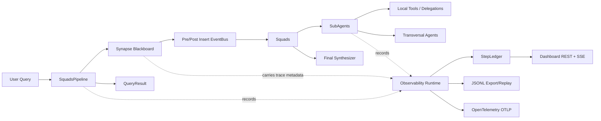

# Agent Squad Go

A Go port of the AGAPES Agent Squads framework and Synapse blackboard engine, redesigned for safe concurrent multi-agent execution, traceability, and human-friendly observability.

## What This Project Provides

- A blackboard messaging engine (`pkg/synapse`) for context, task, and command messages.
- A multi-agent orchestration layer (`pkg/squads`) with squads, subagents, transversal agents, observers, and final synthesis.
- An observability layer (`pkg/observability`) that records spans, business-level steps, JSONL traces, correlated logs, and optional OpenTelemetry export.
- A dashboard (`pkg/dashboard`) with REST endpoints, SSE live streaming, embedded web UI, graph projection, timeline, and metrics summaries.

## Architecture At A Glance



## Project Structure

```
agent-squad-go/
├── cmd/
│   ├── squad-demo/           # End-to-end demo with optional dashboard, JSONL, and OTel
│   └── squad-dashboard/      # Standalone dashboard for live or persisted traces
├── pkg/
│   ├── dashboard/            # REST API, SSE stream, embedded UI, graph/metrics projections
│   ├── observability/        # Trace context, spans, step ledger, hub, exporters, OTel runtime
│   ├── synapse/              # Core blackboard engine and persisted message model
│   └── squads/               # Multi-agent orchestration framework
├── tests/
│   ├── dashboard/            # Dashboard graph/API/SSE/replay tests
│   ├── observability/        # Tracing, logging, and OTel tests
│   ├── squads/               # Agent, squad, metrics, tool, and propagation tests
│   └── synapse/              # EventBus, SendMessage, ConsumeTask, GC tests
├── go.mod
└── README.md
```

## Package Responsibilities

### `pkg/synapse`

Synapse is the blackboard engine. It stores messages, emits lifecycle hooks, supports task consumption, and keeps trace metadata attached to persisted messages so asynchronous callbacks can reconstruct causality.

- `models.go`: defines `SynapseMessage`, roles, message classes, trace metadata, and constructors for context/task/command messages.
- `engine.go`: owns in-memory indexes, context cache, atomic task consumption, storage writes, post-insert dispatch, and TTL garbage collection.
- `events.go`: implements the pre-insert/post-insert event bus used by observers, squads, and transversals.
- `storage.go`: defines the persistence boundary (`BaseStorage`) plus the default in-memory-only `NoopStorage`.
- `agent-squad.code-workspace`: local VS Code workspace helper.

### `pkg/squads`

Squads is the orchestration layer. It routes a query to one or more squads, runs subagents concurrently, delegates tasks, waits for the execution tree to become quiescent, and returns a traceable `QueryResult`.

- `pipeline.go`: top-level coordinator, routing, lifecycle, quiescence detection, timeout, max-iteration guard, result assembly.
- `squad.go`: squad event subscriptions, subagent fan-out, squad-level coordination, parent-thread replies.
- `agent.go`: base agents, subagents, transversal agents, LLM loop, tool calls, delegation, tool-healing retries.
- `blackboard.go`: blackboard abstraction, Synapse adapter, parent-thread map, bounded metrics store, observability runtime holder.
- `metrics.go`: thread-safe execution metrics for squads, agents, observers, transversals, LLM usage, and delegations.
- `observer.go`: pre-insert middleware, including reference expansion.
- `synthesizer.go`: context compaction through synthesis checkpoints.
- `telemetry.go`: shared observability helpers for spans, steps, correlated logging, and trace reconstruction from persisted messages.

### `pkg/observability`

Observability captures both infrastructure spans and human-readable business steps.

- `tracer.go`: local `Tracer`/`Span` contracts, noop tracer, recorder tracer for tests, and OpenTelemetry adapter.
- `otel_runtime.go`: OTLP gRPC provider/exporter setup driven by `SQUAD_OTEL_*` configuration.
- `step.go`: `AgentStep`, step kinds, `StepLedger`, query summaries, deduplication, and live hub broadcast.
- `hub.go`: non-blocking pub/sub for live dashboard updates.
- `exporter.go`: stdout and JSONL export/import for replayable traces.
- `context.go`: trace and step IDs carried through `context.Context`.
- `logger.go`: `slog` enrichment with `trace_id`, `span_id`, `correlation_id`, `causation_id`, and `step_id`.
- `attributes.go`: canonical attribute names shared by spans, logs, and dashboard projections.

### `pkg/dashboard`

The dashboard exposes observability data for humans.

- `server.go`: HTTP server bootstrap, embedded UI, route registration, optional trace-file replay.
- `api.go`: REST endpoints for query lists, timelines, graph data, and metrics summaries.
- `sse.go`: Server-Sent Events stream for live `AgentStep` updates.
- `graph.go`: transforms timelines into graph nodes/edges and summary metrics.
- `model.go`: JSON contracts consumed by the web UI.
- `web/`: static frontend assets embedded into the Go binary.

## Execution Flow

1. `SquadsPipeline.Query` receives the user query and creates the root trace context.
2. The route function chooses the initial squad or squads.
3. The pipeline writes user messages into Synapse squad threads.
4. Synapse persists messages, stores trace metadata, and fires post-insert callbacks.
5. Squads receive matching messages and run their subagents concurrently on isolated agent threads.
6. Agents call the LLM, invoke local tools, or delegate tasks to transversals/other squads.
7. Parent-child thread relationships are tracked through `ParentThreadMap`.
8. The pipeline waits until the execution tree reaches quiescence or the query times out.
9. The final synthesizer produces the response.
10. Metrics, timeline steps, logs, JSONL traces, dashboard data, and optional OTel spans are available for inspection.

## Loop And Completion Safety

- The dashboard graph is observational only; it does not control execution depth.
- `SquadsPipeline` prevents unbounded execution with `MaxIterations` and query timeout.
- Quiescence is calculated by resolving the root thread, collecting all child threads, and checking active executions plus pending replies.
- Task consumption in Synapse is atomic under a mutex so two workers cannot consume the same task concurrently.

## Key Design Decisions

### Thread Safety

- Shared maps and counters are protected by `sync.RWMutex`, `sync.Mutex`, or atomics.
- `ExecutionMetrics` uses a single top-level mutex with internal locked helpers to avoid reentrant locking.
- `SynapseService` uses `sync.RWMutex` for read-heavy context fetches and exclusive locks for writes/consumption.

### Concurrency Model

- Python's `asyncio.gather` is replaced by `sync.WaitGroup` for concurrent sub-agent execution.
- Post-insert callbacks run in independent goroutines with `recover()` guards.
- Squads and transversals subscribe to Synapse events instead of being called directly by the pipeline.

### Composition Over Inheritance

- `BaseAgent` is embedded into `SubAgent` and `TransversalAgent`.
- `BlackboardBus` is a pure interface; `SynapseBlackboardBus` adapts `synapse.SynapseService`.

### Traceability

- `TraceContext` is propagated through `context.Context` and persisted onto `SynapseMessage.Trace`.
- Async callbacks rebuild trace linkage from message metadata.
- `AgentStep` records business-level events while spans capture infrastructure-level timing.
- Logs are correlated through `trace_id`, `span_id`, `correlation_id`, `causation_id`, and `step_id`.

## Running

```bash
go run ./cmd/squad-demo/
```

Optional runtime flags and environment variables:

- `SQUAD_DASHBOARD_ADDR` starts the embedded observability dashboard inside the demo process.
- `SQUAD_TRACE_JSONL` exports each completed query timeline to a JSONL file for later inspection.
- `SQUAD_OTEL_ENABLED` turns on the OpenTelemetry tracer runtime in the demo.
- `SQUAD_OTEL_ENDPOINT` points the OTLP gRPC exporter at a collector such as `127.0.0.1:4317`.
- `SQUAD_OTEL_INSECURE` disables TLS for local collectors.
- `SQUAD_OTEL_HEADERS` sets OTLP headers as a comma-separated `key=value` list.
- `SQUAD_OTEL_SERVICE_NAME`, `SQUAD_OTEL_SERVICE_VERSION`, and `SQUAD_OTEL_TRACER_NAME` override the default resource and tracer identity.
- `SQUAD_OTEL_BATCH_TIMEOUT` overrides the span batch timeout using Go duration syntax such as `250ms` or `2s`.

Example workflow:

1. Run the demo with a shared in-process dashboard.
2. Enable `SQUAD_TRACE_JSONL` when you want durable traces.
3. Enable `SQUAD_OTEL_ENABLED` plus an OTLP endpoint when you want the same spans exported to an external collector.
4. Open the standalone dashboard against the exported file when you want to inspect traces outside the demo process.

Example with both JSONL replay and OTLP export enabled:

```powershell
$env:SQUAD_TRACE_JSONL = ".\\traces\\agent-steps.jsonl"
$env:SQUAD_OTEL_ENABLED = "true"
$env:SQUAD_OTEL_ENDPOINT = "127.0.0.1:4317"
$env:SQUAD_OTEL_INSECURE = "true"
go run ./cmd/squad-demo/
```

Standalone dashboard:

```bash
go run ./cmd/squad-dashboard --addr 127.0.0.1:8080 --trace-file ./traces/agent-steps.jsonl
```

The standalone dashboard tails the JSONL file incrementally and deduplicates steps by `step_id`, so you can refresh or reopen the UI without duplicating the visual timeline.

## Dashboard API

- `GET /api/queries`: returns query summaries plus metrics.
- `GET /api/queries/{correlation_id}/timeline`: returns raw `AgentStep` entries.
- `GET /api/queries/{correlation_id}/graph`: returns graph nodes and edges for visualization.
- `GET /api/metrics/summary?query={correlation_id}`: returns aggregate duration, token, LLM/tool, agent, and error metrics.
- `GET /api/stream`: opens an SSE stream of live `AgentStep` events.

## OpenTelemetry

OpenTelemetry is optional. The project pins OTel to the Go 1.22-compatible `v1.35.0` line. Newer OTel versions may raise the module Go baseline.

When enabled, the demo builds an OTLP gRPC tracer provider and adapts it to the local `observability.Tracer` interface. JSONL and OTel can be enabled at the same time: JSONL is best for local replay/dashboard inspection, while OTel is best for external collectors such as Jaeger, Tempo, or an OpenTelemetry Collector.

## Testing

```bash
go test ./... -v -count=1
```

Focused suites:

```bash
go test ./tests/synapse
go test ./tests/squads
go test ./tests/observability
go test ./tests/dashboard
```
